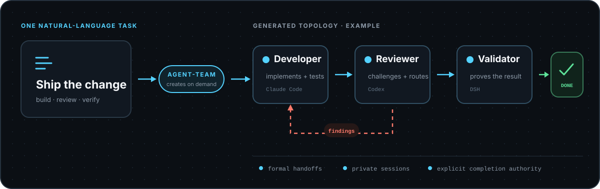
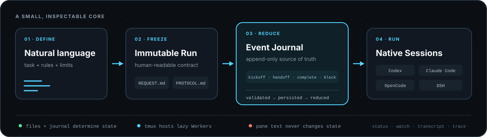
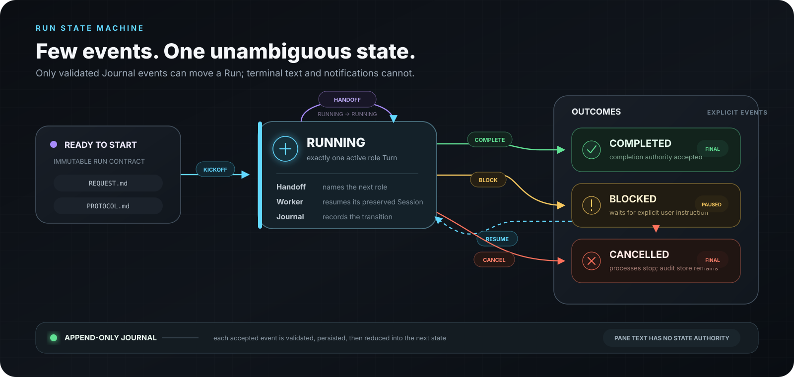

# Agent-Team

[](https://github.com/jicezeng/agent-team/actions/workflows/ci.yml)

Agent-Team is an event-driven local runtime for temporary AI-agent teams.
Describe a task and collaboration rules in natural language; Agent-Team creates
the roles and topology for that Run, coordinates Codex, Claude Code, OpenCode,
and DeepSeek Harness, and preserves resumable Sessions and auditable handoffs until
Completion or Block.

## The task defines the team

Agent-Team has no permanent team and no hard-coded Developer–Reviewer flow.
For each Run, its Skill turns the request into dynamic roles and a readable
`PROTOCOL.md`. During execution, a formal Handoff event names the next role, so
the emerging collaboration is a task-specific directed graph rather than a
workflow users must prebuild in a DSL.

Role specifications are frozen for audit, while Agent processes are dynamic:
only the currently routed External role owns a Worker/tmux window. A Handoff
retires the sender and lazily creates the receiver, preserving only the
configured Harness Session when `resume` was selected.

Start with the work scenario, not an abstract graph template. The Skill derives
the roles, handoff route, feedback loop, and completion authority that make that
specific job effective:

<p align="center">
  
</p>

| Scenario | High-value, common collaboration pattern | Typical completion authority |
| --- | --- | --- |
| Software delivery | Developer implements and tests ↔ independent Reviewer returns every finding | Reviewer completes after a clean full review |
| Multimedia production | Creative brief → medium-specific Producer ↔ Editor iterates on the package | Creative director approves the final package |
| Research and decision support | Researcher ↔ skeptical Fact-checker → Synthesizer | Decision owner accepts sourced evidence and explicit uncertainty |
| Incident response | Triage → dynamically selected Specialist → independent Verifier | Incident commander accepts a verified mitigation |

These are examples, not built-in templates. A request may rename roles, add
quality gates, loop on findings, or route the next Turn to whichever specialist
the current evidence requires. Stage 1 supports serial paths, cycles, and
dynamic routing through explicit single-token transitions, but not simultaneous
Fan-out/Join, keeping one shared worktree deterministic.

## A small, inspectable core

<p align="center">
  
</p>

The plugin layer turns each task into a readable protocol instead of compiled
workflow code. Immutable files, hashed payloads, and the Event Journal are the
durable source of truth. tmux only hosts detachable processes and visibility;
Pane text, logs, and best-effort notifications cannot change Run state. Workers
rescan the Journal, so losing a tmux notification never loses a Handoff.

Only a small set of formal events changes business state:

<p align="center">
  
</p>

The result is deliberately local and mechanically simple: no permanent manager
Agent, compiled workflow engine, database, or Pane-scraping control loop.
Natural language defines collaboration semantics, while a small event-sourced
runtime protects ownership, process identity, Session continuity, trace
integrity, and fail-closed recovery.

## Requirements

- macOS or Linux, Python 3.11+, `uv`, Git, and tmux
- Only the Harnesses selected by a team: an authenticated Codex, Claude Code,
  or OpenCode CLI; DeepSeek Harness roles require Node.js, pnpm, and
  `DEEPSEEK_API_KEY`
- One normal Git worktree root per Run

## Install

Install from a source checkout on macOS or Linux:

```bash
git clone https://github.com/jicezeng/agent-team.git
cd agent-team
uv tool install --force .
agent-team install
```

Then verify the target worktree and installed Harnesses:

```bash
agent-team doctor --workspace /path/to/worktree --json
```

Installation does not require or probe any Harness CLI. Agent-Team installs its
Skills/plugin and trusted DSH Origin tool bundle; the pinned DSH runtime is
provisioned only when a team first selects a DSH role. DSH Profile activation is
explicit. See the [user guide](docs/user-guide.md#installation-and-upgrades).

## Quick start

The recommended entry point is the installed `agent-team` Skill in Codex,
OpenCode, or DeepSeek Harness. Open it in the Git worktree the team should modify:

```bash
cd /path/to/worktree
agent-team doctor --workspace "$PWD" --json
codex
# or: opencode / dsh
```

Then describe the team and task:

```text
$agent-team

Use one Claude Code Opus 4.7 max as Developer and one independent Codex gpt5.6
sol max as Reviewer. Preserve both Sessions. The Developer implements and tests
the change. The Reviewer is the completion authority and sends every P0-P3
finding back to the Developer. Repeat the fix and full-review loop until no
finding remains.

Task: <describe the change>
Limits: at most 12 role turns and 7200 seconds.
```

The skill writes the immutable Request and Protocol, starts the Run, follows
handoffs, and returns either Completion or a user-visible Block to the Origin
session.

New External roles default to `full-access` (YOLO), which disables the Harness
host sandbox, opens command network access, and suppresses per-command approval
prompts. The skill must obtain explicit confirmation once for each new Run and
passes `--confirm-full-access` only after that confirmation. Choose the
restricted `default` or `trusted-workspace` Profile explicitly when host
containment is required.

| Profile | Host boundary | Extra capability |
| --- | --- | --- |
| `default` | Workspace-contained | Codex command network disabled; OpenCode arbitrary Bash denied |
| `trusted-workspace` | Workspace-contained | Codex command network or OpenCode built-in web tools enabled |
| `full-access` | Unrestricted host access | Host shell and network enabled |

OpenCode has no OS Bash sandbox, so its restricted Profiles permit workspace
file tools and formal Agent-Team commands but deny arbitrary Bash.
DSH External roles are interactive-only; restricted Profiles sandbox writes to
the workspace but inherit host reads, process execution, and network access.

Agent-Team freezes its requested mapping in `launch_profile_sha256`, isolates
OpenCode project config and external plugins, and safely freezes selected
Codex, Claude Code, OpenCode, and DSH Provider routes. Only referenced
environment variables cross into the role Worker; their values never enter Run
records. Agent-Team also sets Codex
`features.hooks=false`, but Managed Harness policy can still change or
reject the effective configuration. Inspect `doctor` output and administrator
policy when a permission boundary matters.

## Observe and manage a Run

Run these from the owned worktree; the Run ID is optional for active-Run
observation commands:

| Command | Purpose |
| --- | --- |
| `agent-team status` | Current Run, active role, health, and next action |
| `agent-team watch` | Follow derived Run snapshots |
| `agent-team attach [--role <role>]` | Open the active tmux view read-only |
| `agent-team transcript` | Reconstruct Turn inputs, events, and outputs |
| `agent-team tail` | Read or follow normalized trace events |
| `agent-team diagnose` | Inspect failures and recovery evidence |
| `agent-team recover <run-id>` | Apply deterministic technical recovery |
| `agent-team cancel <run-id>` | Stop the Run while retaining its audit store |

Detach from `attach` with tmux's `Ctrl-b d`. Formal Handoff, Completion, Block,
and Resume decisions always go through Agent-Team's validated journal, never
through Pane text or manual TUI input.

See the [user guide](docs/user-guide.md) for manual CLI bootstrap, role options,
Claude workspace trust, observability modes, formal actions, Block/Resume,
recovery, Unlock, and data-retention boundaries.

## Documentation

- [User guide](docs/user-guide.md): installation and operations
- [Product requirements](agent-team_prd_v0.1.md): scope and acceptance criteria
- [Technical design](agent-team_technical_design_v0.1.md): normative runtime
  and recovery contract
- [DeepSeek Harness integration](docs/deepseek-harness-integration-design.md):
  Origin Skill and interactive External Adapter design
- [Validation evidence](docs/validation/README.md): retained real-run reports

## Development

```bash
uv sync --locked
uv run pytest
uv run ruff check --select F src tests
uv run python -m compileall -q src tests
uv build
```
