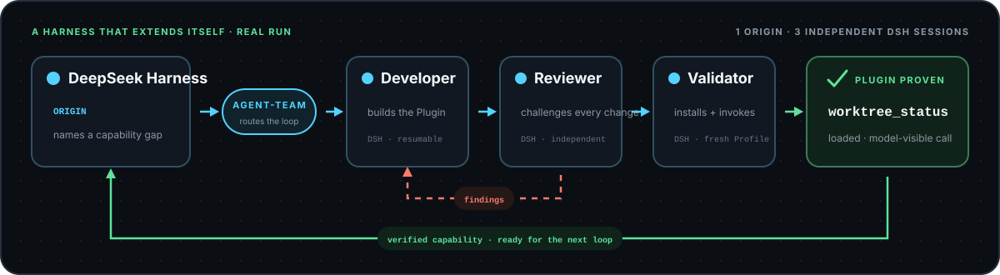

<h1 align="center">Agent-Team</h1>

<p align="center"><strong>Not another coding agent. The runtime that turns agents into a team.</strong></p>

<p align="center">
  Turn one natural-language task into a temporary, event-driven team across
  Codex, Claude Code, OpenCode, and DeepSeek Harness—then keep the build,
  review, and verification loop moving until a formal completion.
</p>

<p align="center">
  <a href="https://github.com/jicezeng/agent-team/actions/workflows/ci.yml"></a>
  
  <a href="LICENSE"></a>
</p>

<p align="center">
  
</p>

<p align="center"><strong>The task defines the team. Events drive the work. Evidence closes the loop.</strong></p>

<p align="center">
  <a href="docs/validation/deepseek-harness-self-plugin-v0.1.5-validation-report.md"></a>
</p>

## One prompt. A whole team.

After [installation](#install), open Codex, OpenCode, or DeepSeek Harness in
the worktree the team should own, then invoke the installed Agent-Team Skill
(`$agent-team` in Codex, the native Skill in OpenCode, or `/agent-team` in DSH):

```text
$agent-team

Use one Claude Code Opus 4.7 max as Developer and one independent Codex gpt5.6
sol max as Reviewer. Preserve both Sessions. The Developer implements and tests
the change. The Reviewer is the completion authority and sends every P0-P3
finding back to the Developer. Repeat the fix and full-review loop until no
finding remains.

Task: <describe the change>
Limits: at most 12 role turns and 7200 seconds.
```

The Skill freezes a readable collaboration contract, creates each role process
only when first routed, and follows formal Handoff events until Completion or a
user-visible Block. There is no graph DSL to prebuild and no permanent manager
Agent consuming the context window.

## Why Agent-Team

- **Task-shaped teams.** Roles, routes, feedback loops, quality gates, and
  completion authority are generated for the job instead of selected from a
  fixed Developer–Reviewer template.
- **Native, independent Agents.** Every role runs in its real interactive
  Harness with a private configuration and Session; selected Sessions can
  resume on later Turns.
- **Native capabilities come with them.** Enabled Plugin and MCP configuration
  is frozen before Kickoff for every External role, then loaded from private
  Run-owned state in Codex, Claude Code, OpenCode, and DeepSeek Harness.
- **Durable truth.** Immutable Run inputs and an append-only Event Journal—not
  terminal text or notifications—determine state and reconstruct the audit
  trail.
- **A deliberately small core.** Files, a compact state reducer, Harness
  adapters, and lazy tmux Workers provide deterministic recovery without a
  database or compiled workflow engine.

## Proven in real Harnesses

These are retained real-machine Runs, not simulated workflow examples:

| Run | What completed |
| --- | --- |
| [Four-Harness relay](docs/validation/four-harness-interactive-v0.1.5-validation-report.md) | Codex → Claude Code → OpenCode → DSH → resumed Codex across five formal Turns, with independent Sessions and Full Audit traces |
| [DSH self-hosted Plugin](docs/validation/deepseek-harness-self-plugin-v0.1.5-validation-report.md) | Independent DSH Developer → Reviewer → fresh Validator built, reviewed, installed, loaded, and invoked a new model-visible Plugin |

## How it works

<p align="center">
  
</p>

Only validated `Kickoff`, `Handoff`, `Complete`, `Block`, `Resume`, and `Cancel`
events move a Run. tmux is a detachable process host and observation surface;
pane content never controls business state.

Agent-Team v0.1 keeps one active role token in one shared worktree. It supports
serial paths, cycles, and evidence-driven dynamic routing, but deliberately not
simultaneous Fan-out/Join.

## Install

Agent-Team requires macOS or Linux, Python 3.11+, `uv`, Git, and tmux. Only the
Harnesses selected by a team need to be installed and authenticated.

```bash
git clone https://github.com/jicezeng/agent-team.git
cd agent-team
uv tool install --force .
agent-team install
```

Verify the target worktree and available Harnesses:

```bash
agent-team doctor --workspace /path/to/worktree --json
```

Installation does not probe every Harness. The pinned DSH runtime is
provisioned lazily only when a team first selects a DSH role. See the
[installation guide](docs/user-guide.md#installation-and-upgrades) for wheels,
upgrades, and development installs.

> [!WARNING]
> External roles default to `full-access` (YOLO). Agent-Team asks for explicit
> confirmation once for each new Run and records it through
> `--confirm-full-access`. Managed Harness policy may still narrow or extend
> the effective boundary. Choose `default` or `trusted-workspace` when host
> containment is required; see [permission profiles](docs/user-guide.md#permission-profiles).

Codex private profiles set `features.hooks=false`; `launch_profile_sha256` and
`agent-team doctor` expose the frozen local contract, not overriding Managed policy.

## Observe and manage

Run these from the owned worktree; observation commands detect its active Run:

| Command | Purpose |
| --- | --- |
| `agent-team status` | Show the active role, health, and next action |
| `agent-team watch` | Follow derived Run snapshots |
| `agent-team attach [--role <role>]` | Open the active tmux view read-only |
| `agent-team transcript` | Reconstruct Turn inputs, events, and outputs |
| `agent-team tail` | Follow normalized trace events |
| `agent-team diagnose` | Inspect failures and recovery evidence |

Detach from `attach` with `Ctrl-b d`. Recovery, cancellation, manual bootstrap,
audit modes, Provider routing, and retention boundaries are documented in the
[user guide](docs/user-guide.md).

## Documentation

- [User guide](docs/user-guide.md) — installation and operations
- [Product requirements](agent-team_prd_v0.1.md) — scope and acceptance criteria
- [Technical design](agent-team_technical_design_v0.1.md) — normative runtime contract
- [DeepSeek Harness integration](docs/deepseek-harness-integration-design.md) — Origin and External Adapter design
- [Validation evidence](docs/validation/README.md) — retained real-run reports

<details>
<summary><strong>Development</strong></summary>

```bash
uv sync --locked
uv run pytest
uv run ruff check --select F src tests
uv run python -m compileall -q src tests
uv build
```

</details>
