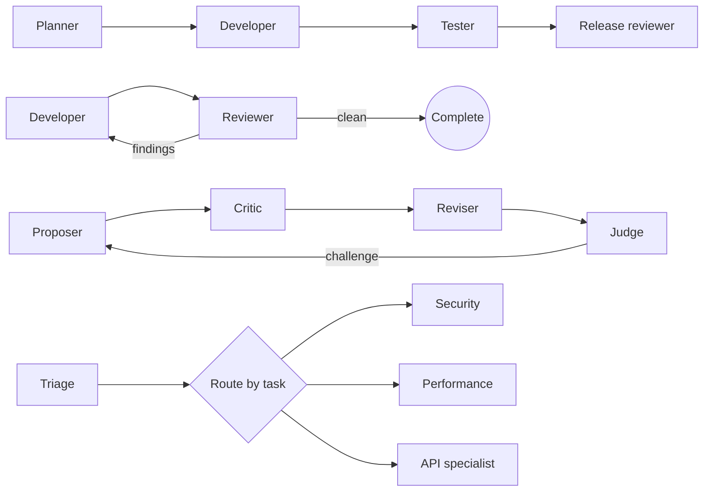
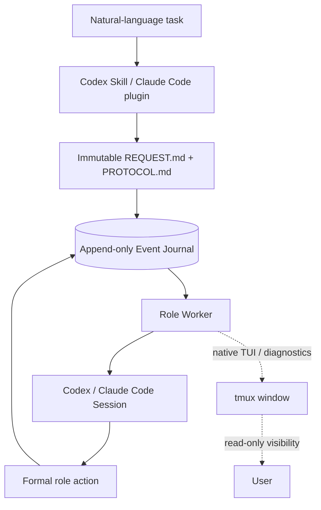
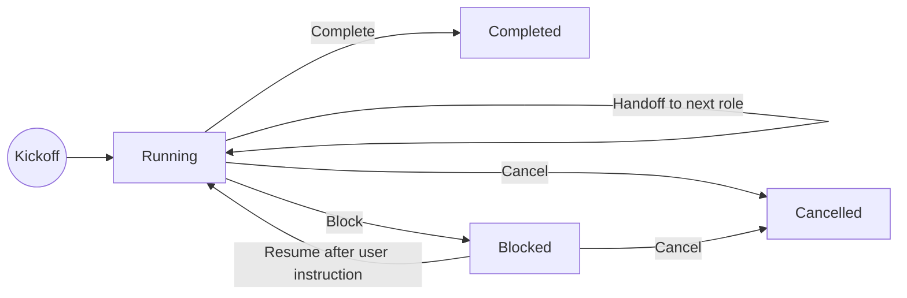

# Agent-Team

[](https://github.com/jicezeng/agent-team/actions/workflows/ci.yml)

Agent-Team is an event-driven local runtime for temporary coding-agent teams.
Describe a task and collaboration rules in natural language; Agent-Team creates
the roles and topology for that Run, coordinates Codex and Claude Code, and
preserves resumable Sessions and auditable handoffs until Completion or Block.

## The task defines the team

Agent-Team has no permanent team and no hard-coded Developer–Reviewer flow.
For each Run, its Skill turns the request into dynamic roles and a readable
`PROTOCOL.md`. During execution, a formal Handoff event names the next role, so
the emerging collaboration is a task-specific directed graph rather than a
workflow users must prebuild in a DSL.

The same runtime can express many classic collaboration patterns:



Any topology expressible as explicit single-token transitions can use the same
runtime: edges may be conditional and graphs may contain cycles. Stage 1
supports serial paths, loops, and dynamic routing, but not simultaneous
branches or parallel Fan-out/Join. This keeps shared-worktree collaboration
deterministic while leaving the business topology flexible.

## A small, inspectable core



The plugin layer turns each task into a readable protocol instead of compiled
workflow code. Immutable files, hashed payloads, and the Event Journal are the
durable source of truth. tmux only hosts detachable processes and visibility;
Pane text, logs, and best-effort notifications cannot change Run state. Workers
rescan the Journal, so losing a tmux notification never loses a Handoff.

Only a small set of formal events changes business state:



The result is deliberately local and mechanically simple: no permanent manager
Agent, compiled workflow engine, database, or Pane-scraping control loop.
Natural language defines collaboration semantics, while a small event-sourced
runtime protects ownership, process identity, Session continuity, trace
integrity, and fail-closed recovery.

## Requirements

- macOS or Linux, Python 3.11+, `uv`, Git, and tmux
- Codex CLI and/or Claude Code CLI, already installed and authenticated
- One normal Git worktree root per Run

## Install

Install from a source checkout on macOS or Linux:

```bash
git clone https://github.com/jicezeng/agent-team.git
cd agent-team
uv tool install --force .
agent-team install
```

Then verify the target worktree and installed Harnesses:

```bash
agent-team doctor --workspace /path/to/worktree --json
```

Agent-Team installs its bundled Codex skill and Claude Code plugin, but it does
not install or authenticate either Harness CLI. Wheel, development, upgrade,
and integration-location instructions are in the
[user guide](docs/user-guide.md#installation-and-upgrades).

## Quick start

The recommended entry point is the installed `$agent-team` Codex skill. Open
Codex in the Git worktree the team should modify:

```bash
cd /path/to/worktree
agent-team doctor --workspace "$PWD" --json
codex
```

Then describe the team and task:

```text
$agent-team

Use one Claude Code Opus 4.7 max as Developer and one independent Codex gpt5.6
sol max as Reviewer. Preserve both Sessions. The Developer implements and tests
the change. The Reviewer is the completion authority and sends every P0-P3
finding back to the Developer. Repeat the fix and full-review loop until no
finding remains.

Task: <describe the change>
Limits: at most 12 role turns and 7200 seconds.
```

The skill writes the immutable Request and Protocol, starts the Run, follows
handoffs, and returns either Completion or a user-visible Block to the Origin
session.

New External roles default to `full-access` (YOLO), which disables the Harness
host sandbox, opens command network access, and suppresses per-command approval
prompts. The skill must obtain explicit confirmation once for each new Run and
passes `--confirm-full-access` only after that confirmation. Choose the
restricted `default` or `trusted-workspace` Profile explicitly when host
containment is required.

| Profile | Filesystem | Command network |
| --- | --- | --- |
| `default` | Workspace-contained | Disabled |
| `trusted-workspace` | Workspace-contained | Enabled |
| `full-access` | Unrestricted host access | Enabled |

Agent-Team freezes its requested mapping in `launch_profile_sha256` and sets
Codex `features.hooks=false`, but Managed Harness policy can still change or
reject the effective configuration. Inspect `doctor` output and administrator
policy when a permission boundary matters.

## Observe and manage a Run

Run these from the owned worktree; the Run ID is optional for active-Run
observation commands:

| Command | Purpose |
| --- | --- |
| `agent-team status` | Current Run, active role, health, and next action |
| `agent-team watch` | Follow derived Run snapshots |
| `agent-team attach [--role <role>]` | Open the active tmux view read-only |
| `agent-team transcript` | Reconstruct Turn inputs, events, and outputs |
| `agent-team tail` | Read or follow normalized trace events |
| `agent-team diagnose` | Inspect failures and recovery evidence |
| `agent-team recover <run-id>` | Apply deterministic technical recovery |
| `agent-team cancel <run-id>` | Stop the Run while retaining its audit store |

Detach from `attach` with tmux's `Ctrl-b d`. Formal Handoff, Completion, Block,
and Resume decisions always go through Agent-Team's validated journal, never
through Pane text or manual TUI input.

See the [user guide](docs/user-guide.md) for manual CLI bootstrap, role options,
Claude workspace trust, observability modes, formal actions, Block/Resume,
recovery, Unlock, and data-retention boundaries.

## Documentation

- [User guide](docs/user-guide.md): installation and operations
- [Product requirements](agent-team_prd_v0.1.md): scope and acceptance criteria
- [Technical design](agent-team_technical_design_v0.1.md): normative runtime
  and recovery contract
- [Validation evidence](docs/validation/README.md): retained real-run reports

## Development

```bash
uv sync --locked
uv run pytest
uv run ruff check --select F src tests
uv run python -m compileall -q src tests
uv build
```
