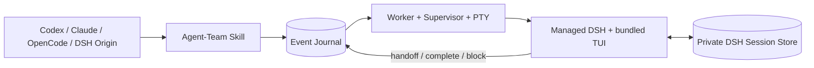

# Agent-Team × DeepSeek Harness 集成技术方案

> **状态**：双向集成已实现，并已通过真实三 Turn 交互式闭环验证  
> **日期**：2026-08-16  
> **基线**：Agent-Team v0.1.8；DeepSeek Harness `0.1.0-rc.6`

## 1. 决策

DeepSeek Harness（DSH）支持两个独立方向：

1. **DSH 作为 Origin**：加载 Agent-Team 的共享 Skill；普通团队可调用既有 CLI，
   DSH-Origin → DSH-External 团队通过可信 `agent_team_cli` 工具调用同一 CLI，避免
   model-facing Bash 的 Credential Scrub 阻断子 Agent 认证。
2. **DSH 作为 External Role**：Agent-Team 在 tmux 中启动受管 DSH 交互式 TUI，
   并在后续 Turn 恢复同一原生 DSH Session。

两条路径都复用 Agent-Team 的 Role、Turn、正式动作、Append-only Event Journal 和
恢复状态机。不增加 Python SDK Bridge、第二套事件协议或 DSH 专用团队状态机。

External DSH 与 Codex、Claude Code 的默认控制方式对齐：都是受管 PTY 中的交互式
CLI，可 `attach` 观察并可跨 Turn Resume。DSH Adapter 是 interactive-only，不提供
Headless Mode；显式请求
`headless` 会在 Kickoff 前以 `LAUNCH_MODE_UNSUPPORTED` 拒绝。

## 2. 架构



所有权边界保持单一：

- Agent-Team 拥有 External DSH 的进程、Session Ref、Turn 和正式动作；
- DSH 原生 Session Store 只保存模型会话，不决定团队 Token；
- tmux Pane、TUI 文本和键盘输入只用于交互与观察，不能改变 Run 状态；
- Handoff、Complete、Block、Resume 和 Cancel 只有写入 Journal 后才生效。

## 3. 安装与版本冻结

`agent-team install` 完成两类 DSH 集成安装：

- 把 Codex 同源 Skill 复制到 `$DSH_HOME/skills/agent-team`，供 DSH Origin 使用；
- 把 `@agent-team/dsh-origin` Bundle 复制到
  `$DSH_HOME/plugins/agent-team-origin`，由用户显式加入所选 DSH Profile。

只有团队选择 DSH External Role 时，Adapter 才用 pnpm 安装精确版本
`@deepseek-ai/dsh@0.1.0-rc.6` 到固定账号状态目录的
`installed/deepseek-harness-runtime`。已有合规 Runtime 直接复用。

受管 Runtime：

- 锁定 npm package version 和 integrity；
- 使用 `--prod --ignore-scripts --package-import-method=copy`；
- 安装后验证 lockfile、package version、`dsh --version`、可执行路径和 Symlink 边界；
- 通过同目录临时树和原子 rename 发布；
- 只替换带 Agent-Team Ownership Marker 的旧 Runtime，拒绝覆盖未知目录；
- 不加入 `PATH`，也不替代用户自行安装的 DSH Origin CLI。

Node.js 和 pnpm 只是 DSH External Role 的按需前提，不是 `agent-team install` 的前提。
Codex、Claude Code、OpenCode CLI 也只在团队选择对应 Role 时检查；External DSH 不依赖
用户的 DSH 安装或 Profile。

## 4. 私有 Profile 与 TUI

每个 DSH External Role 使用：

```text
<fixed-state>/harness-homes/deepseek-harness/<run-digest>/<role-id>/
├── agent-team-home.json
├── profiles/agent-team/
│   ├── package.json
│   ├── cordis.patch.yml
│   └── node_modules/@agent-team/dsh-tui/
└── sessions/
```

若该 Role 声明 `--role-dsh-plugin ROLE=<workspace-package-directory>`，首次路由到
它时还会把当时的 Package 内容复制到上述 Profile 的 `node_modules`，将 Package
Bundle 插入 `dsh.profile.bundles`，并写入不可变的文件 Manifest 与内容 Hash。Role
直接在自己的受管 DSH 中调用该插件；不从模型 Bash 启动子 DSH，也不把父 DSH 的
Credential 转交给模型工具进程。

Adapter 在该 Role 首次接收路由前创建私有 `DSH_HOME`，复制 bundled TUI，并冻结以下
Profile：

- 只加载 `@deepseek-ai/dsh-base`、`@agent-team/dsh-tui`，以及该 Role 显式声明、
  首次激活时冻结的至多一个 Workspace DSH Bundle；
- 禁用 HMR、Telemetry、Title LLM 和会话内 Permission 切换；
- 禁用用户 Profile、Skill、Subagent、Workflow 与 Ralph，避免未受管递归 Worker；
- Session 使用无压缩私有 JSONL Store；
- Approval 固定为 `never`；Sandbox Mode 只由 Launch Profile 环境决定。

`launch_profile_sha256` 除常规 Adapter/Executable/Profile 映射外，还覆盖受管 DSH 版本、
npm integrity 和 bundled TUI 的逐文件 Hash。升级导致含义变化时，既有 Run 按
Profile Changed Fail Closed，不静默采用新实现。

## 5. 交互与 Session Resume

TUI 接受一个不可变 Turn Prompt，并在完成首轮后保留 `dsh> ` 输入循环：

```text
dsh --profile agent-team \
  (--session-id <ref> | --resume <ref>) \
  --provider <provider> --model <model> \
  --reasoning-effort <off|high|max> <prompt-pointer>
```

首次 Turn 调用 DSH 原生 `agents.create`；Resume Turn 在新的受管进程中调用
`agents.resume`。`resume` Role 的 Session Ref 根据 Run、Role 和 Session Generation
确定生成；启动 Resume 前必须在私有 Store 中找到相同 ID 且 Session Header 的 `cwd`
等于冻结 Workspace。缺失、重复、损坏或越界都 Fail Closed。

TUI 只渲染公开模型文本、有限 Tool 状态，以及不含正文的 `[thinking]` 标记。它不把
private reasoning text 输出到 PTY。PTY 字节进入现有 Diagnostic/Raw Retention 路径；
与其他 Interactive Adapter 一样，Pane 文本不是结构化完成或路由证据。

若首轮 DSH `turn/end` 的结构化原因不是 `completed`（例如 Provider 返回 Quota、认证
或请求错误），TUI 必须非零退出，使现有 Supervisor/Worker 以技术失败 Fail Closed；
不得回到 `dsh> ` 后把失败 Turn 留成假性 `RUNNING`。TUI 必须等待该结构化事件，不能
用 `whenIdle()` 的先后顺序猜测终态；只有首轮正常完成后才保留输入循环。若模型已经
提交正式 Outbox，Supervisor 仍可在事件到达前按 Outbox 合同终止进程组。

External Turn 获得标准环境：

```text
AGENT_TEAM_RUN_ID
AGENT_TEAM_ROLE_ID
AGENT_TEAM_TURN_ID
AGENT_TEAM_RUN_DIR
AGENT_TEAM_TURN_DIR
AGENT_TEAM_CLI
```

模型仍须通过精确 `$AGENT_TEAM_CLI handoff|complete|block` 写入唯一正式 Outbox。
Supervisor 验证 Outbox、Session Ref 和进程结果后终止整个受管进程组；TUI 不需要自行
退出才能完成 Turn。

## 6. Model、认证与权限

DSH Model 使用 `provider/model`：

- 默认：`deepseek-official/deepseek-v4-flash`；
- Reasoning Effort：`off`、`high` 或 `max`，默认 `high`；
- Fast Mode 不支持；
- 认证状态以非空 `DEEPSEEK_API_KEY` 为可判定前提，真实请求仍 Fail Closed。

三个 Launch Profile 都显式禁用逐命令审批：

| Profile | DSH Sandbox | 实际边界 |
| --- | --- | --- |
| `default` | `workspace-write` | 写效果限制在 Workspace；读取、进程、网络继承宿主 |
| `trusted-workspace` | `workspace-write` | v0.1 与 `default` 相同 |
| `full-access` | `danger-full-access` | 不保留 Harness Host 文件边界 |

DSH Sandbox 是文件写效果边界，不是完整的 Host Sandbox。受限 Profile 不能宣称阻止
工作区外读取、环境凭据访问、进程执行或网络。省略 Profile 仍按产品统一规则选择
`full-access`，首次 Kickoff 前需要本 Run 一次明确 YOLO 确认；该确认不授权 DSH
Origin，DSH Origin 的权限仍由其宿主会话单独控制。

## 7. Origin 路径

DSH Origin 继续复用 Codex Skill Source。安装目标由同一 `DSH_HOME` 解析函数决定：

- 未设置或空白：`~/.dsh`；
- 只展开当前用户的 `~` / `~/...`；
- 拒绝 `~user` 和相对路径。

共享 Skill 在 DSH Managed Shell 看到 `DSH_SHELL=1` 时，为 `init` 显式传入
`--origin-harness deepseek-harness`。该变量只选择审计元数据，不授予权限。真实 DSH
Skill Load 仍是 Resource Root 的权威；`doctor` 只能验证 Agent-Team 安装副本。

DSH 的 model-facing Bash 按设计删除 Credential-shaped 环境变量。若团队包含 DSH
External Role，Origin 必须使用显式激活的 `agent_team_cli` 工具，而不是 Bash：

- 工具只接受 Agent-Team 公共子命令参数数组，不经过 Shell；
- Agent-Team 可执行路径在插件生命周期内只解析一次；
- 每次调用通过 DSH Credential Service 解析 `DEEPSEEK_API_KEY`，仅作为受管
  Agent-Team 子进程的显式环境项；输出不包含 Credential；
- Profile 激活由用户执行 `dsh plugin --profile <name> add
  <DSH_HOME>/plugins/agent-team-origin`，`agent-team install` 不修改用户 Profile。

Origin 内部工具过程不由 Agent-Team 捕获。Full Audit 因此仍要求 Origin 只做控制面，
所有业务角色使用 External Binding。

## 8. Doctor 与生命周期

`doctor` 对 DSH External Adapter 检查：

- Node.js、pnpm 和受管 Runtime 的版本、integrity、路径；
- `DEEPSEEK_API_KEY` 可见性；
- 只有 `interactive` Launch Mode；
- 三个 Profile 的 Start/Resume 等价映射；
- bundled TUI manifest 与原生 `agents.resume` 合同；
- 活跃 Run 的冻结 Fingerprint。

它不会发送模型请求，也不证明 API Key 有效、网络可达或 DSH Sandbox 的上游实现。

只有对应 Runner Process Group 已证明 Quiescent 后，Adapter 才收紧私有 DSH Home 的
权限。Ownership Marker 不匹配、未知特殊文件或指向私有 Home/受管 Runtime 之外的
Symlink 都阻止清理并进入完整性故障。

## 9. 验收边界

发布前必须同时通过：

1. wheel 包含 DSH TUI 与 Origin Bundle，`agent-team install` 在没有 Node.js、pnpm 或
   任一 Harness CLI 时仍可完成；首次选择 DSH Role 时才安装并复验固定 Runtime；
2. 配置、Profile、Model、Launch Mode、私有 Home、Session 发现和清理的单元测试；
3. 真实 DSH 进程完成 Session Create，并由另一个进程 Resume 同一 Session；
4. 真实 Agent-Team Run 至少两次调度同一个 DSH `resume` Role，通过正式动作完成闭环；
5. `attach` 可观察 DSH TUI，Transcript/Trace 不把 private reasoning 正文作为公开消息；
6. Completion 后 Owner、Worker、Runner 和 tmux Runtime 均安全收口。
7. 真实 DSH Origin 通过 `agent_team_cli` 启动至少一个 DSH External Role，凭据不出现
   在模型消息、Bash 环境、工具结果或 Agent-Team Trace 中。

Origin 方向的历史证据见
[`deepseek-harness-origin-v0.1.4-validation-report.md`](validation/deepseek-harness-origin-v0.1.4-validation-report.md)；
External 方向的证据见
[`deepseek-harness-interactive-v0.1.4-validation-report.md`](validation/deepseek-harness-interactive-v0.1.4-validation-report.md)。

## 10. 非目标与限制

- 不通过 Python SDK、JSON-RPC Bridge 或 DSH Subagent Provider 控制 External Role；
- 不支持 DSH Headless External Role；
- 不把 TUI 文本、`[thinking]` 或 Tool 状态升级为业务事件；
- 不复制用户 DSH Profile、Credential Store 或 Session Store；
- 不宣称受限 DSH Profile 是读取、网络或进程 Sandbox；
- 不改变单 Token、单 Worktree、无 Fan-out/Join 的 Agent-Team v0.1 边界。
